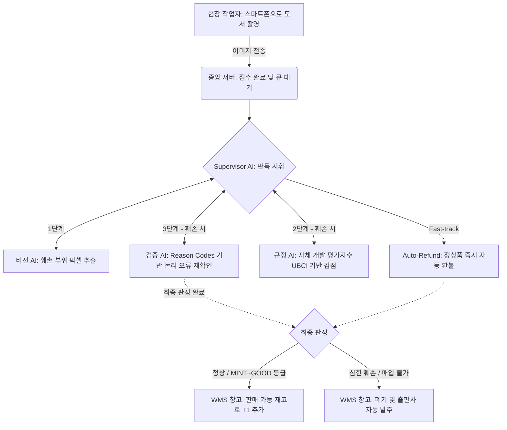
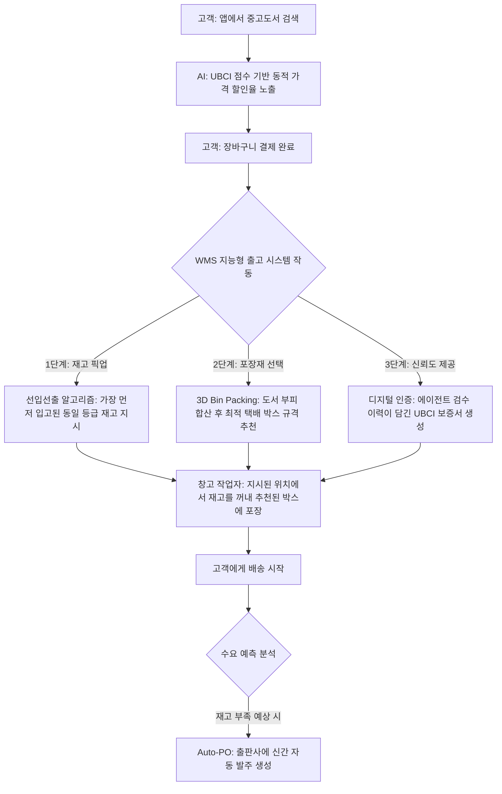

# 📖 B2B WMS AI Platform: 비전공자 및 비즈니스 관계자를 위한 이해 가이드

본 문서는 IT 전문 지식이 없는 분들도 우리 프로젝트가 **"어떤 문제를 해결하고, 어떻게 작동하는지"** 직관적으로 이해할 수 있도록 작성된 프로세스 상세 가이드입니다. 

---

## 1. 우리가 해결하려는 문제 (Why?)

인터넷 서점이나 중고 도서 플랫폼은 하루에도 수천 권의 책을 사고팝니다. 여기서 가장 큰 병목(Bottleneck)은 **'반품'과 '중고 매입'**입니다.

*   **현재의 문제점:** 사람이 일일이 책을 넘겨가며 찢어진 곳, 낙서된 곳을 찾습니다. 책이 1,000권이면 1,000번 똑같은 노동을 해야 합니다. 피곤하면 놓치기도 하고, 사람마다 "이 정도면 깨끗한데?" 하는 기준이 달라 고객과 환불 분쟁이 일어납니다.
*   **우리의 솔루션:** 스마트폰 카메라로 책을 찍기만 하면, **AI가 사람을 대신해 순식간에 책의 상태를 판독하고, 회사 규정에 맞춰 자동으로 등급(A급, B급 등)을 매기는 시스템**입니다.

---

## 2. 입고 및 검수 프로세스 (Inbound Flow)

우리 시스템은 크게 **[스마트폰(프론트엔드)] ➡️ [중앙 서버(백엔드)] ➡️ [AI 에이전트 체인] ➡️ [창고 DB(WMS)]** 라는 4단계 거대한 파이프라인을 거칩니다.

### 🔍 각 단계별 상세 설명 (비유 포함)

**1) 현장 작업자의 촬영 (Client)**
작업자는 복잡한 컴퓨터 스캐너를 쓰지 않습니다. 그저 거치대에 놓인 스마트폰 아래에 책을 펼치고 발로 '풋페달'을 밟으면 찰칵 찍힙니다. 이때 스마트폰 내부(WebRTC/WASM 기술)에서 즉시 흔들린 사진을 걸러내고 용량을 압축하여 서버 전송 속도를 극대화합니다.
> 💡 *비유하자면, 톨게이트 하이패스처럼 책이 지나가기만 하면 폰이 알아서 정리한 뒤 서버로 쾌속 전송하는 환경입니다.*

**2) 비전 AI의 훼손 감지 (Vision Agent)**
사진이 서버로 넘어오면 가장 먼저 '비전 AI(GPT-4o)'가 사진을 분석합니다. 사람이 자를 대고 2cm를 재는 것이 불가능하기 때문에, AI는 **책 전체 면적 대비 얼룩이 차지하는 픽셀 비율(%)**을 계산합니다. 만약 상태가 새것처럼 깨끗한 'MINT' 등급이라면, 복잡한 다음 단계를 건너뛰고 **프리패스(Fast-track)로 즉시 자동 환불(Auto-refund)**을 승인합니다.

**3) 사내 규정 AI의 채점 및 검증 (Policy & Critic Agent)**
어디가 찢어졌는지 찾았다면, 이제 점수를 깎을 차례입니다. '규정 AI'는 사전에 입력된 자체 개발 상태 평가지수(UBCI)를 바탕으로 감점을 진행합니다. 이때 단순히 찢어진 길이를 재는 것이 아니라 **책 크기 대비 훼손 비율(Relative Ratio BBox)**을 계산하며, 한 페이지에 여러 번 감점되지 않도록 **페이지 단위 감점(Page-level Penalty)** 룰을 적용해 억울한 감점을 막습니다. 이후 '검증 AI(Critic)'가 개입해 점수 계산에 오류가 없는지 재확인하며, 이 과정에서 **Reason Codes(오류 분류표)**를 써서 투명하게 이유를 남깁니다. 중간에 사람이 확인해야 할 모호한 사안이 생기면 게임을 일시 정지(Pause)하듯 잠시 멈췄다가, 사람이 확인 후 다시 재생(Resume)하는 **MemorySaver(기억 보존)** 기술도 적용되었습니다.

**4) 창고 관리 시스템(WMS) 연동 (입고 완료)**
AI의 채점이 끝나서 "이 책은 80점(B급)입니다"라는 결과가 나오면, 이 결과는 우리 회사의 거대한 창고 관리 데이터베이스(WMS)에 자동으로 기록됩니다. 즉, 사람이 엑셀에 칠 필요 없이 "해리포터 1권 (B급) - 1권 추가"가 전산에 자동으로 반영됩니다.

---

## 3. 판매 및 출고 프로세스 (Outbound Flow)

책이 창고로 들어오는 것(입고) 못지않게, 고객에게 팔려서 나가는 것(출고)도 중요합니다. 우리 시스템은 5가지 스마트한 기능을 통해 물류비용을 줄이고 고객 만족도를 높입니다.

### 🔍 핵심 출고 기능 (비유 포함)

1.  **똑똑한 가격표 붙이기 (동적 가격 책정):** 똑같은 B급이라도, AI가 매긴 점수가 높은 책은 조금 더 비싸게 팔고 점수가 턱걸이인 책은 싸게 팝니다. 악성 재고가 안 쌓이게 돕는 거죠.
> 💡 *비유하자면, 마트 마감 세일 때 상태가 안 좋은 과일부터 더 싼 가격표를 붙여 먼저 팔아버리는 것과 같습니다.*
2.  **오래된 책 먼저 빼기 (선입선출 - FIFO):** 주문이 들어오면, 창고 작업자에게 "이 B급 책들 중에서 제일 창고에 오래 있었던 저쪽 구석의 책을 꺼내오세요"라고 지시합니다. 책이 누렇게 바래는 걸 막아줍니다.
3.  **택배 박스 자동 추천 (3D Bin Packing):** 고객이 책을 5권 샀다면, 시스템이 책들의 두께와 크기를 순식간에 더해서 "이 주문은 2호 박스에 담으시면 택배비가 가장 쌉니다"라고 알려줍니다. 과대 포장으로 인한 배송비 낭비를 막습니다.
4.  **AI 품질 보증서 발급 (UBCI Certificate):** 중고책을 산 고객에게 "이 책은 3페이지에 1cm 얼룩이 있어서 B급을 받았습니다"라는 디지털 품질 보증서(QR코드)를 동봉합니다. 고객은 중고책이라도 찝찝함 없이 믿고 살 수 있게 되죠!
5.  **수요 예측 자동 발주 (Demand Forecasting & Auto-PO):** 물건이 너무 빨리 팔려나가면 시스템이 "곧 재고가 바닥나겠습니다"라고 예측하고, 알아서 출판사에 신간 발주서를 팩스나 이메일로 넣습니다.

---

## 4. 우리 시스템만의 차별화된 기술력 (Tech Point)

단순히 AI API를 호출하는 학생 수준의 프로젝트가 아니라, 실제 기업용(Enterprise) 환경에서 발생할 수 있는 문제를 모두 차단했습니다.

*   **Offline-First 및 낙관적 UI (체감 속도 0초):** 창고 구석에서 와이파이가 끊기거나 서버가 바빠도 작업자는 멈추지 않습니다. 화면에는 '완료'된 것처럼 즉시 보여주고(낙관적 UI), 실제 데이터는 뒷단에서 알아서 서버로 척척 보냅니다.
*   **비동기 큐잉 (서버 다운 완벽 방지):** 연말정산 기간처럼 수만 건의 데이터가 동시에 몰려도 서버는 무너지지 않습니다. **Redis와 Celery**라는 강력한 대기열 시스템을 도입하여, 맛집의 '대기 번호표 기계'처럼 일단 주문을 안전하게 쌓아두고 서버가 소화할 수 있는 만큼만 꺼내서 쾌적하게 처리합니다.
*   **투명한 AI 관제 (LLMOps):** AI가 왜 이런 판정을 내렸는지 블랙박스처럼 숨겨져 있지 않고, **LangSmith**라는 관제 시스템을 통해 AI의 생각 과정을 추적할 수 있어 고객에게 확실하게 이유를 설명할 수 있습니다.

### 🛡️ [ver1.4.2.0 핵심 아키텍처] 대규모 트래픽 3대 방어 논리
1. **gevent 코루틴 풀 (I/O 병목 해소):** AI 워커가 OpenAI API 응답(15초)을 기다리는 동안 스레드가 멈추지 않고(Non-blocking) 수백 개의 요청을 병렬 처리하도록 최적화.
2. **KEDA 하이브리드 오토스케일링:** 땀(CPU)을 흘리지 않는 AI 워커들을 효과적으로 증설하기 위해, Redis 큐에 쌓인 '대기열 길이'를 모니터링하여 KEDA로 파드를 즉각 증설.
3. **Tenacity 지수 백오프 & 다중 API Key:** OpenAI API의 429(Rate Limit) 에러 발생 시, 뻗지 않고 2초->4초->8초 대기 후 우아하게 재시도하며, 상용화 시 다중 API Key를 라운드로빈으로 돌려 부하 분산.
