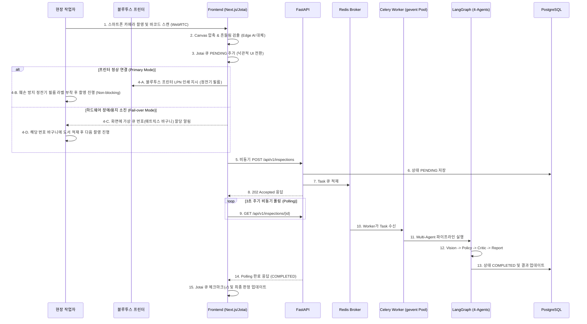
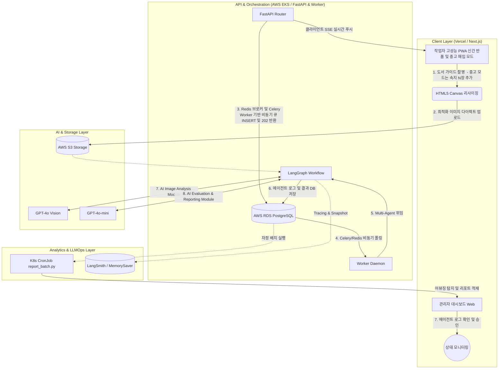
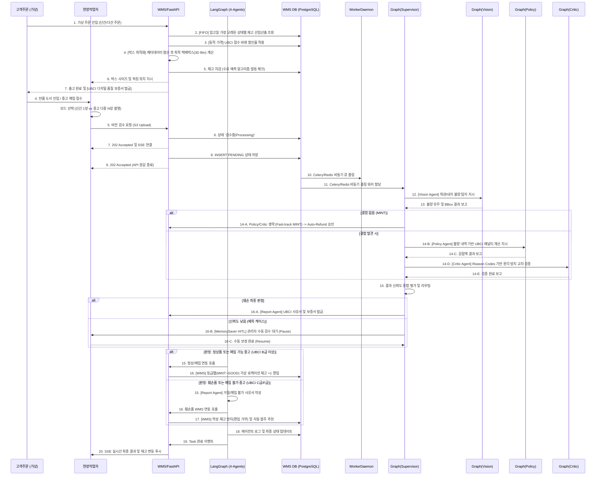
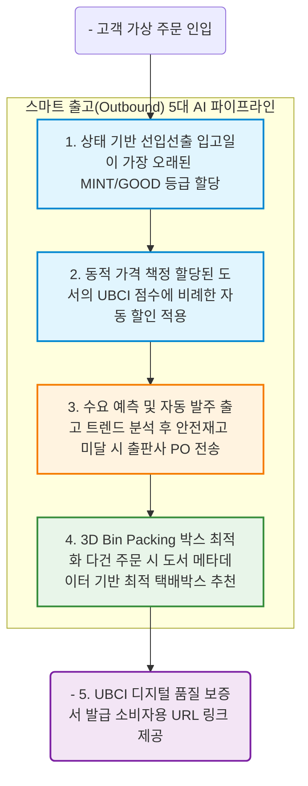

# [Tech PM Planner] 멀티 에이전트 기반 B2B 도서 물류(입출고·반품) 자동화 및 AI 재고 관리(WMS) 플랫폼 워크플로우 (ver1.4.2.0)

## 1. 과제 정의 및 핵심 목표 (Project Definition & Objective)
본 프로젝트는 기존 수작업에 의존하던 도서 이커머스 반품 검수 프로세스를 **VLM(Vision-Language Model)과 LangGraph 기반 멀티 에이전트(Multi-Agent)**를 활용해 자동화하는 B2B SaaS 플랫폼을 구축하는 것입니다. 
개발 기간(6+1주 압축) 및 팀 구성을 고려하여, 핵심 시각 판독은 강력한 GPT-4o에 위임하고 텍스트 기반 논리 전개는 GPT-4o-mini에 위임하여 속도와 정확성을 동시에 잡는 파이프라인을 구축합니다. Tech PM은 Git Gatekeeper, DevOps 매니저, Kanban 마스터 역할을 전담하여 인프라 안정성을 극대화합니다.

---

## 2. 시스템 아키텍처 및 워크플로우 (System Architecture & Workflow)

### 2.2 WMS 통합 입고(Inbound) 라우팅 흐름도

새 책은 다이렉트로 입고 처리되며, 중고/반품 서적은 4-Agent AI 검수대로 향하는 WMS 입고 첫 관문 라우팅 구조입니다.



### 2.3 반품/중고 서적 전용 4-Agent AI 검수 워크플로우 (System Architecture & Workflow)

전체 시스템은 **Client(모바일/웹) -> API/백엔드 -> AI/Storage**의 3계층으로 분리되어 동작합니다. VLM 추론 시 발생하는 레이턴시(Latency) 병목을 막기 위해 **비동기 폴링(Polling) 방식**과 LangGraph를 결합합니다.

### 2.3.1 통합 시스템 아키텍처 도해도 (Mermaid)



### 2.2 검수 자동화 시퀀스 다이어그램 (Sequence Diagram)



---

### 2.4 스마트 출고(Outbound) 5대 파이프라인 흐름도

물류의 완벽한 순환(Closed-loop)을 위해, 반품/입고뿐만 아니라 **출고 과정에도 AI와 데이터 분석이 개입**하여 악성 재고를 방지하고 물류비를 최적화합니다.



---

## 3. 핵심 데이터베이스 스키마 (Core DB Schema)

관계형 데이터베이스(PostgreSQL)를 활용하며, 다중 에이전트가 뱉어내는 다양한 중간 상태(State)와 사유서를 유연하게 저장하기 위해 `JSONB` 타입을 적극 활용합니다.

| Table Name | Column Name | Data Type | Constraint | Description |
| :--- | :--- | :--- | :--- | :--- |
| `books` | `id` | UUID | PK | 원본 도서 고유 ID |
| | `title` | VARCHAR | NOT NULL | 도서명 |
| | `virtual_stock` | INT | DEFAULT 0 | [WMS] 실제 가용 재고 수량 |
| `locations` | `id` | UUID | PK | [WMS] 창고 진열대 (예: A-1-3) |
| `orders` | `id` | UUID | PK | [WMS] 가상 고객 주문 데이터 |
| `return_jobs` | `id` | UUID | PK | 반품 검수 작업 고유 ID |
| | `status` | VARCHAR | NOT NULL | PENDING, PROCESSING, RESTOCKED, REJECTED |
| | `agent_logs` | **JSONB** | NULL | LangSmith Trace ID 및 Reason Codes 등 히스토리 |
| | `final_report` | TEXT | NULL | Report Agent가 작성한 거래처 송부용 사유서 |
| `inventory_logs`| `id` | UUID | PK | [WMS] 입출고 트랜잭션 기록 |

---

## 4. 현실적 제약 및 방어 전략 (Risks & Mitigation)

### 🛑 1. Multi-Agent 레이턴시 지연 (Agent Latency)
* **Risk:** 4개의 에이전트가 순차적으로 LLM API를 호출하므로 검수 1건당 15초 이상의 지연이 발생할 수 있습니다.
* **Mitigation:** **Star Topology & Fast-track 라우팅.** 정상품(MINT)은 Policy/Critic을 거치지 않고 즉시 Auto-Refund 처리하여 대기시간을 최소화합니다. 또한 API는 DB에 큐만 적재 후 즉시 `202 Accepted`를 반환하고, Worker가 Celery/Redis 없이 Redis & Celery로 가져가 비동기 처리합니다.

### 🛑 2. K8s 러닝 커브로 인한 개발 기한 초과 (Learning Curve)
* **Risk:** 7주 기한 내에 주니어 팀원들이 K8s 환경을 완벽히 이해하고 배포하는 것은 프로젝트 좌초 리스크가 있습니다.
* **Mitigation:** **인프라 개발의 병렬 격리.** 5주 차까지는 익숙한 Docker Compose나 로컬 환경에서 핵심 비즈니스 로직(LangGraph) 완성에만 집중합니다. 백엔드 리드(BE-Pro) 1명만이 6주 차에 EKS(또는 온프레미스 K8s) 매니페스트를 작성하여 1차 배포를 시도하는 방식으로 리스크를 통제합니다.

### 🛑 3. 초기 인프라 세팅 병목으로 인한 API 통신 지연 (Infra Setup Delay)
* **Risk:** AWS RDS(VPC) 및 S3(Presigned URL) 세팅에 시간이 소요되어 프론트엔드의 업로드 기능 개발이 지연될 수 있습니다.
* **Mitigation:** **DB/스토리지 투트랙(Two-Track) 롤백.** 1주차 내에 AWS 환경 구성(Plan A)이 완료되지 않을 경우, 즉시 SaaS형 관리 서비스인 Supabase(Plan B)로 롤백하여 비즈니스 로직 개발에 지장이 없도록 통제합니다. 두 환경 모두 PostgreSQL(JSONB)을 지원하므로 코드 수정 비용은 0에 수렴합니다.

### 🛑 4. 비용 상승 방어 (Cost Optimization)
* **Risk:** 최고 성능 모델인 GPT-4o를 모든 곳에 쓰면 1건당 추론 비용이 30~50원을 넘어갈 수 있습니다.
* **Mitigation:** 가장 중요한 이미지 객체 인식(Vision Agent)에만 **GPT-4o**를 투입하고, 환불 규정과 텍스트를 다루는 3개의 에이전트(Policy, Critic, Report)는 저렴한 **GPT-4o-mini**를 사용하여 건당 내부 기준의 KPI를 방어합니다.

### 🛑 5. 리포트 서버 부하 방어 (FDS & 데이터 통계)
* **Risk:** 무거운 Pandas 및 Scikit-learn 연산을 API 서버 메모리 위에서 구동하면 K8s OOM(Out Of Memory) 킬이 발생해 실시간 트래픽이 마비됩니다.
* **Mitigation:** 백엔드와 완전히 격리된 별도의 `report_batch.py` 스크립트를 작성하고, 이를 **K8s CronJob**으로 자정(00:00)에 1회용 Pod으로 띄워 안전하게 집계 후 종료시킵니다.

### 🛑 6. 외부 API 도서 메타데이터 누락 (Missing Dimensions)
* **Risk:** 출판사 DB나 외부 API에서 도서의 가로/세로/무게 정보가 누락되어 들어오면 3D Bin Packing(박스 최적화) 알고리즘이 에러를 뱉고 다운됩니다.
* **Mitigation:** **도서 규격 Fallback 추정 로직 도입.** 데이터가 Null일 경우, 도서 카테고리(소설=신국판, 전공=B5)와 페이지 수(100p=10mm, 1p=1.2g)를 기반으로 부피와 무게를 근사치로 자동 계산하는 방어 로직을 탑재하여 100%에 가까운 패킹 성공률을 보장합니다.

### 🛑 7. 물류센터 하드웨어 장애로 인한 전체 시스템 마비 (Hardware Failure)
* **Risk:** 대량 반품 시 동일 물품 섞임을 방어하기 위해 도입된 '블루투스 감열식 프린터'가 용지/잉크 소진이나 연결 끊김으로 작동을 멈추면 작업대 전체가 멈추는 병목이 발생합니다.
* **Mitigation:** **무중단 장애 조치(Hardware Fail-over Protocol) 시스템 전환.** 프린터 응답이 없거나 에러가 감지되면, 프론트엔드 UI가 즉시 'LPN 출력 모드'에서 **'탁상용 매트릭스(Numbered Baskets) 큐 할당 모드'**로 전환됩니다. 화면에 프린터 대기 대신 "바구니 2번에 적재하세요"라는 지시가 뜨게 하여, 프린터를 수리하거나 교체하는 동안에도 작업자의 물류 분류 작업은 1초도 쉬지 않고 지속됩니다.

---

## 5. 개발 마일스톤 (6+1 Week 압축 Roadmap)

```text
+-------------------------------------------------------------------------------+
|                       6+1 Week Project Roadmap (Multi-Agent)                  |
+-------------------+-------------------+-------------------+-------------------+
|  Phase 1 (W1)     |  Phase 2 (W2-W3)  |  Phase 3 (W4-W5)  |  Phase 4 (W6-W7)  |
|  PoC & Planning   |  Core & LangGraph |  Dashboard & UI   |  Freeze & QA Prep |
+-------------------+-------------------+-------------------+-------------------+
| [Tech PM & BE-2/3] | [Tech PM & BE-3]  | [Tech PM & BE-2]  | [Tech PM & BE-3]  |
| 인프라 프로비저닝 | WMS API(출입고)   | SSE 푸시 및 AI통계| W6: Code Freeze   |
| WMS DB 설계 완성  | WMS 코어 로직 구축| AI결과 WMS 연동   | W7: QA & 버그픽스 |
| [AI Lead & BE-1]  | [AI Lead & BE-1]  | [AI Lead & BE-1]  | [AI Lead & BE-1]  |
| 단일 노드 PoC     | 4-Agent 조립 완성 | 프롬프트 고도화   | 시연용 도서 데이터|
| 원시 데이터 확보  | 오토 라벨링 파이프| FDS/어뷰징 탐지   | YOLO 증류 하이브리드|
|                   |                   | (CronJob 배치)    |                   |
| [FE-1 & FE-2]     | [FE-1 & FE-2]     | [FE-1 & FE-2]     | [FE-1 & FE-2]     |
| 보일러플레이트    | 카메라 연동 &     | 대시보드(WMS) 개발| UI 애니메이션 연출|
| 와이어프레임 설계 | 캔버스 리사이징   | 에이전트 로그 뷰어| 크로스 브라우징 QA|
+-------------------+-------------------+-------------------+-------------------+
```
